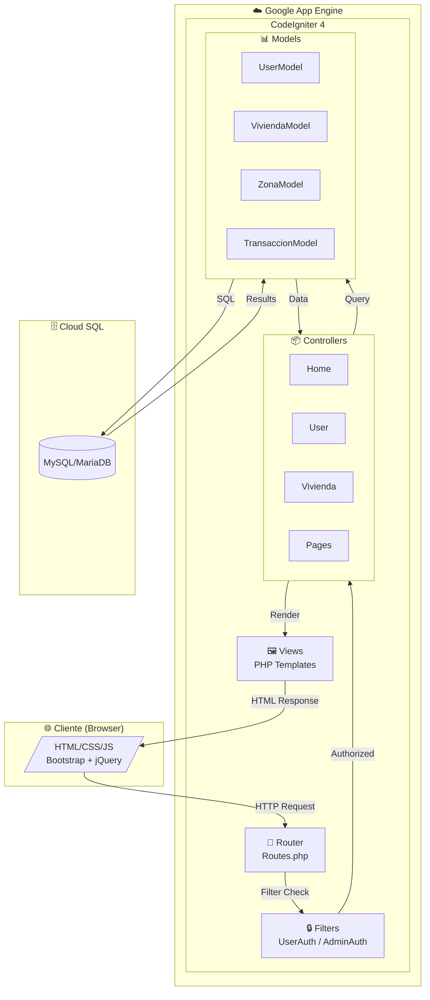
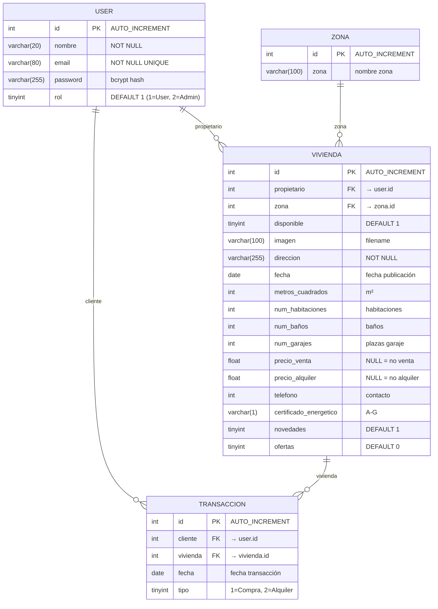
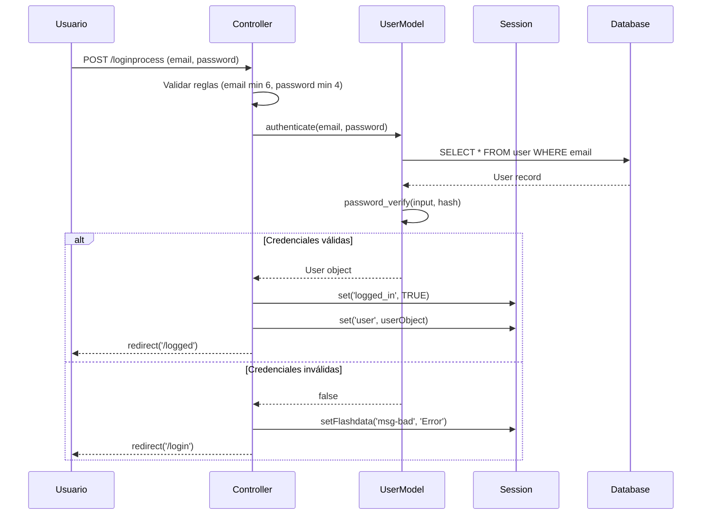
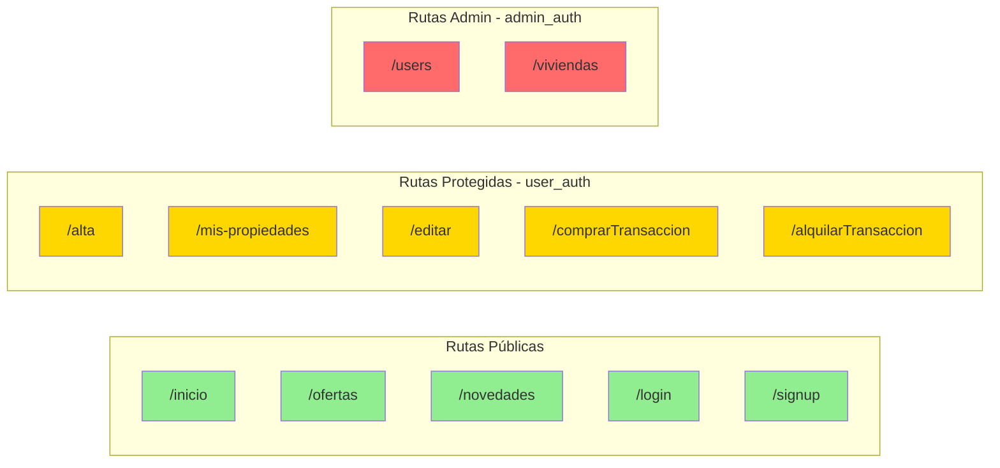
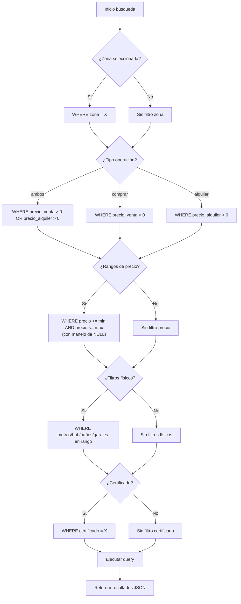

<p align="center">
  
  
  
  
  
  
</p>

<h1 align="center">🏠 Portal Inmobiliario Web</h1>

<p align="center">
  <strong>Plataforma web profesional para la gestión y comercialización de propiedades inmobiliarias</strong>
</p>

<p align="center">
  Una solución full-stack construida con CodeIgniter 4 que permite a propietarios publicar sus viviendas y a clientes buscar, filtrar, comprar o alquilar propiedades inmobiliarias con un sistema avanzado de búsqueda multi-criterio.
</p>

---

## 📋 Tabla de Contenidos

- [🎯 Propósito del Proyecto](#-propósito-del-proyecto)
- [✨ Funcionalidades Principales](#-funcionalidades-principales)
- [🛠️ Stack Tecnológico](#️-stack-tecnológico)
- [📁 Arquitectura del Proyecto](#-arquitectura-del-proyecto)
- [🗃️ Modelo de Datos](#️-modelo-de-datos)
- [🔐 Sistema de Autenticación y Autorización](#-sistema-de-autenticación-y-autorización)
- [🌐 Arquitectura de Rutas y Endpoints](#-arquitectura-de-rutas-y-endpoints)
- [🔍 Motor de Búsqueda Avanzado](#-motor-de-búsqueda-avanzado)
- [🚀 Instalación y Configuración](#-instalación-y-configuración)
- [⚙️ Variables de Entorno](#️-variables-de-entorno)
- [🧪 Testing](#-testing)
- [☁️ Despliegue en Google App Engine](#️-despliegue-en-google-app-engine)
- [📚 Documentación Adicional](#-documentación-adicional)
- [👥 Autores](#-autores)

---

## 🎯 Propósito del Proyecto

### El Problema

El mercado inmobiliario tradicional presenta barreras significativas tanto para propietarios como para compradores/inquilinos:

- **Fragmentación de información**: Las propiedades están dispersas en múltiples plataformas sin criterios uniformes.
- **Filtrado ineficiente**: Los buscadores convencionales ofrecen opciones limitadas que no satisfacen necesidades específicas.
- **Gestión manual**: Los propietarios carecen de herramientas para administrar su portfolio de propiedades.
- **Transacciones no digitalizadas**: El proceso de compra/alquiler requiere intervención presencial.

### La Solución

Este portal inmobiliario ofrece:

1. **Búsqueda Multi-Criterio Dinámica**: Sistema de filtrado en tiempo real con 15+ parámetros combinables (zona, precio compra/alquiler, metros cuadrados, habitaciones, baños, garajes, certificación energética).

2. **Gestión de Portfolio**: Los propietarios registrados pueden dar de alta, editar y eliminar sus propiedades con subida de imágenes.

3. **Transacciones Digitales**: Flujo completo de compra y alquiler con registro en base de datos y actualización automática de disponibilidad.

4. **Escalabilidad Cloud-Native**: Desplegable en Google App Engine con conexión a Cloud SQL para alta disponibilidad.

---

## ✨ Funcionalidades Principales

<details open>
<summary><strong>👤 Gestión de Usuarios</strong></summary>

| Funcionalidad | Descripción |
|---------------|-------------|
| **Registro** | Alta de usuarios con validación de email único y contraseña hasheada (bcrypt) |
| **Login** | Autenticación con sesiones persistentes y mensajes flash |
| **Logout** | Destrucción segura de sesión |
| **Roles** | Sistema de permisos basado en bitmask (Usuario=1, Admin=2) |
| **Mis Propiedades** | Dashboard personal con propiedades publicadas, compradas y alquiladas |

</details>

<details open>
<summary><strong>🏡 Gestión de Viviendas</strong></summary>

| Funcionalidad | Descripción |
|---------------|-------------|
| **Alta de Vivienda** | Formulario completo con subida de imagen y asignación automática de propietario |
| **Edición** | Modificación de todos los campos incluyendo reemplazo de imagen |
| **Eliminación** | Baja de propiedad con confirmación |
| **Listado Público** | Catálogo de propiedades disponibles con tarjetas visuales |
| **Ofertas** | Sección dedicada a propiedades en promoción |
| **Novedades** | Feed de publicaciones recientes |

</details>

<details open>
<summary><strong>💰 Sistema Transaccional</strong></summary>

| Funcionalidad | Descripción |
|---------------|-------------|
| **Compra** | Registro de transacción tipo 1, actualización de disponibilidad |
| **Alquiler** | Registro de transacción tipo 2, historial de alquileres |
| **Historial** | Consulta de propiedades compradas y alquiladas por usuario |

</details>

---

## 🛠️ Stack Tecnológico

### Backend

| Tecnología | Versión | Uso |
|------------|---------|-----|
| **PHP** | 7.4 / 8.x | Lenguaje principal |
| **CodeIgniter 4** | 4.x | Framework MVC |
| **MySQLi** | 10.4+ | Driver de base de datos |
| **Composer** | 2.x | Gestión de dependencias |
| **PHPUnit** | 9.x | Testing unitario y de integración |

### Frontend

| Tecnología | Versión | Uso |
|------------|---------|-----|
| **Bootstrap** | 5.2.3 | Framework CSS responsive |
| **jQuery** | 3.6.4 | Manipulación DOM y AJAX |
| **Boxicons** | 2.1.4 | Iconografía |
| **SweetAlert2** | 10.x | Alertas y modales estilizados |
| **StickyBits** | 3.7.6 | Elementos sticky cross-browser |

### Dependencias PHP (Composer)

```json
{
  "require": {
    "php": "^7.4 || ^8.0",
    "ext-intl": "*",
    "ext-json": "*", 
    "ext-mbstring": "*",
    "laminas/laminas-escaper": "^2.9",
    "psr/log": "^1.1"
  },
  "require-dev": {
    "kint-php/kint": "^5.0.1",
    "fakerphp/faker": "^1.9",
    "phpunit/phpunit": "^9.1"
  }
}
```

### Infraestructura

| Servicio | Rol |
|----------|-----|
| **Google App Engine** | Plataforma de hosting (PHP 7.4 runtime) |
| **Google Cloud SQL** | Base de datos MySQL gestionada |
| **MariaDB** | Desarrollo local |

---

## 📁 Arquitectura del Proyecto

El proyecto sigue la arquitectura **MVC (Modelo-Vista-Controlador)** de CodeIgniter 4:

```
Pagina-web-immobiliaria/
├── 📁 WebappProyecto/                # Aplicación principal
│   ├── 📁 app/                       # Código de la aplicación
│   │   ├── 📁 Config/                # Configuración (Routes, Database, Filters)
│   │   ├── 📁 Controllers/           # Controladores MVC
│   │   │   ├── BaseController.php    # Controlador base con helpers
│   │   │   ├── Home.php              # Landing page
│   │   │   ├── Pages.php             # Páginas estáticas
│   │   │   ├── RegistroLogin.php     # Vistas de auth
│   │   │   ├── User.php              # Lógica de usuarios (CRUD + auth)
│   │   │   └── Vivienda.php          # Lógica de propiedades (CRUD + búsqueda)
│   │   ├── 📁 Filters/               # Middleware de autorización
│   │   │   ├── AdminAuth.php         # Filtro rol administrador
│   │   │   └── UserAuth.php          # Filtro usuario autenticado
│   │   ├── 📁 Models/                # Modelos de datos
│   │   │   ├── TransaccionModel.php  # Transacciones compra/alquiler
│   │   │   ├── UserModel.php         # Usuarios y autenticación
│   │   │   ├── ViviendaModel.php     # Propiedades + Query Builder
│   │   │   └── ZonaModel.php         # Zonas geográficas
│   │   └── 📁 Views/                 # Vistas PHP
│   │       ├── 📁 pages/             # Páginas principales
│   │       ├── 📁 templates/         # Header, Footer
│   │       ├── 📁 user/              # Vistas de usuario
│   │       ├── 📁 vivienda/          # Vistas de propiedades
│   │       └── 📁 errors/            # Páginas de error
│   ├── 📁 public/                    # Recursos públicos (document root)
│   │   ├── 📁 css/                   # Hojas de estilo (14 archivos)
│   │   ├── 📁 js/                    # Scripts (13 archivos)
│   │   ├── 📁 img/                   # Imágenes y uploads
│   │   └── 📁 bootstrap/             # Framework CSS
│   ├── 📁 tests/                     # Suite de testing
│   ├── 📄 .env                       # Variables de entorno
│   ├── 📄 app.yaml                   # Configuración App Engine
│   ├── 📄 composer.json              # Dependencias PHP
│   └── 📄 phpunit.xml.dist           # Configuración PHPUnit
├── 📁 db/                            # Scripts de base de datos
│   └── 📄 webappproyecto.sql         # Schema + datos de prueba
├── 📁 doc/                           # Documentación
│   ├── 📄 Modelo Entidad-Relacion.jpg
│   └── 📄 tabla_controladores.pdf
└── 📄 README.md
```

### Diagrama de Arquitectura MVC



---

## 🗃️ Modelo de Datos

### Diagrama Entidad-Relación



### Zonas Disponibles

El sistema viene preconfigurado con **16 zonas** de Jaén (España):

| ID | Zona | ID | Zona |
|----|------|----|------|
| 1 | Alcantarilla | 9 | San Bartolomé |
| 2 | Avda. Madrid | 10 | San Ildefonso |
| 3 | Bulevar | 11 | San Roque |
| 4 | Catedral | 12 | Universidad |
| 5 | Estación | 13 | Avda. Andalucía |
| 6 | Fuentezuelas | 14 | Jabalcuz |
| 7 | Hospital | 15 | Puente Jontoya |
| 8 | Peñamefecit | 16 | La Magdalena |

---

## 🔐 Sistema de Autenticación y Autorización

### Flujo de Autenticación



### Sistema de Roles (Bitmask)

El sistema utiliza operaciones de bits para gestionar permisos:

| Rol | Valor | Binario | Permisos |
|-----|-------|---------|----------|
| **Usuario** | 1 | `01` | Publicar, editar, comprar, alquilar propiedades |
| **Administrador** | 2 | `10` | Listar todos los usuarios y viviendas |

**Verificación en Filtros:**

```php
// UserAuth.php - Cualquier usuario autenticado
if ((session('user')->role & 1 || 2) == 0)
    return redirect()->to('/unauthorized');

// AdminAuth.php - Solo administradores
if ((session('user')->role & 2) == 0)
    return redirect()->to('/unauthorized');
```

### Filtros de Middleware



---

## 🌐 Arquitectura de Rutas y Endpoints

### Rutas GET (Navegación)

| Ruta | Controlador | Filtro | Descripción |
|------|-------------|--------|-------------|
| `/` | `Home::index` | - | Página de inicio |
| `/inicio` | `Vivienda::viewInicio` | - | Catálogo principal con buscador |
| `/ofertas` | `Vivienda::viewOfertas` | - | Propiedades en oferta |
| `/novedades` | `Vivienda::viewNovedades` | - | Últimas publicaciones |
| `/mas-informacion` | `Pages::viewMasInformacion` | - | Información de contacto |
| `/login` | `RegistroLogin::viewLogIn` | - | Formulario login |
| `/signup` | `RegistroLogin::viewSignUp` | - | Formulario registro |
| `/logout` | `User::logout` | - | Cerrar sesión |
| `/alta` | `Vivienda::viewAlta` | `user_auth` | Formulario nueva vivienda |
| `/mis-propiedades` | `User::misPropiedades` | `user_auth` | Dashboard usuario |
| `/users` | `User::list` | `admin_auth` | Panel admin usuarios |
| `/viviendas` | `Vivienda::list` | `admin_auth` | Panel admin viviendas |

### Rutas POST (Acciones)

| Ruta | Controlador | Filtro | Payload | Respuesta |
|------|-------------|--------|---------|-----------|
| `/loginprocess` | `User::login` | - | `email`, `password` | Redirect |
| `/register` | `User::register` | - | `nombre`, `email`, `password` | Redirect |
| `/subirVivienda` | `Vivienda::darDeAlta` | `user_auth` | FormData (multipart) | Redirect |
| `/editarVivienda` | `Vivienda::editar` | `user_auth` | FormData (multipart) | Redirect |
| `/eliminar` | `Vivienda::eliminar` | `user_auth` | `id` | Redirect |
| `/busquedadProcess` | `Vivienda::buscar` | - | 15 filtros | JSON |
| `/comprarTransaccion` | `Vivienda::comprar` | `user_auth` | `id` | JSON |
| `/alquilarTransaccion` | `Vivienda::alquilar` | `user_auth` | `id` | JSON |

---

## 🔍 Motor de Búsqueda Avanzado

### Parámetros de Filtrado

El sistema implementa un **Query Builder dinámico** en `ViviendaModel::busquedaVivienda()` que construye consultas SQL condicionalmente:

| Parámetro | Tipo | Descripción |
|-----------|------|-------------|
| `selectZona` | int | ID de zona geográfica |
| `opcionSeleccionada` | enum | `ambos`, `comprar`, `alquilar` |
| `minPrecioCompra` / `maxPrecioCompra` | float | Rango precio venta |
| `minPrecioAlquiler` / `maxPrecioAlquiler` | float | Rango precio alquiler |
| `minTamano` / `maxTamano` | int | Rango metros cuadrados |
| `minHabitaciones` / `maxHabitaciones` | int | Rango habitaciones |
| `minBanos` / `maxBanos` | int | Rango baños |
| `minGarages` / `maxGarages` | int | Rango garajes |
| `selectCertificado` | char | Certificado energético (A-G) |

### Lógica del Query Builder



<details>
<summary><strong>📝 Código del Motor de Búsqueda</strong></summary>

```php
public function busquedaVivienda($dataPost) {
    $builder = $this->db->table($this->table);

    // Filtro por zona
    if (!empty($dataPost['selectZona'])) {
        $builder->where('zona', $dataPost['selectZona']);
    }

    // Filtro por tipo de operación
    if (!empty($dataPost['opcionSeleccionada'])) {
        switch($dataPost['opcionSeleccionada']) {
            case 'ambos':
                $builder->groupStart()
                        ->where('precio_venta >', 0)
                        ->orWhere('precio_alquiler >', 0)
                        ->groupEnd();
                break;
            case 'comprar':
                $builder->where('precio_venta >', 0);
                break;
            case 'alquilar':
                $builder->where('precio_alquiler >', 0);
                break;
        }
    }
    
    // Rangos de precio con manejo de NULL
    if (!empty($dataPost['minPrecioCompra'])) {
        $builder->groupStart()
                ->where('precio_venta >=', $dataPost['minPrecioCompra'])
                ->orWhere('precio_venta', 0)
                ->orWhere('precio_venta IS NULL')
                ->groupEnd();
    }
    
    // ... más filtros ...
    
    $query = $builder->get();
    return $query->getResult();
}
```

</details>

---

## 🚀 Instalación y Configuración

### Requisitos Previos

- **PHP** >= 7.4 con extensiones: `intl`, `json`, `mbstring`, `mysqli`
- **Composer** 2.x
- **MySQL** 5.7+ o **MariaDB** 10.4+
- **Apache** o **Nginx** con mod_rewrite habilitado

### Instalación Paso a Paso

```bash
# 1. Clonar el repositorio
git clone https://github.com/tu-usuario/Pagina-web-immobiliaria.git
cd Pagina-web-immobiliaria/WebappProyecto

# 2. Instalar dependencias PHP
composer install

# 3. Crear base de datos
mysql -u root -p -e "CREATE DATABASE webappproyecto CHARACTER SET utf8 COLLATE utf8_unicode_ci;"

# 4. Importar schema y datos de prueba
mysql -u root -p webappproyecto < ../db/webappproyecto.sql

# 5. Configurar variables de entorno
cp env .env
# Editar .env con tu configuración (ver sección Variables de Entorno)

# 6. Iniciar servidor de desarrollo
php spark serve
# La aplicación estará disponible en http://localhost:8080
```

### Configuración para Desarrollo Local

> ⚠️ **IMPORTANTE**: Para desarrollo local, edita el archivo `.env` y realiza los siguientes cambios:

```env
# Comentar la configuración de producción
# database.default.hostname = 34.65.85.132
# database.default.database = twb
# ...

# Descomentar la configuración local
database.default.hostname = localhost
database.default.database = webappproyecto
database.default.username = webappuser
database.default.password = admin
database.default.DBDriver = MySQLi

# Comentar la URL de producción
# app.baseURL = 'https://tbw2223-5-jar.oa.r.appspot.com'
```

---

## ⚙️ Variables de Entorno

El archivo `.env` contiene toda la configuración de la aplicación:

<details open>
<summary><strong>🔧 Configuración Completa</strong></summary>

| Variable | Descripción | Ejemplo |
|----------|-------------|---------|
| **CI_ENVIRONMENT** | Entorno de ejecución | `development` / `production` |
| **app.baseURL** | URL base de la aplicación | `https://mi-app.com` |

#### Base de Datos

| Variable | Descripción | Valor por Defecto |
|----------|-------------|-------------------|
| `database.default.hostname` | Host del servidor MySQL | `localhost` |
| `database.default.database` | Nombre de la base de datos | `webappproyecto` |
| `database.default.username` | Usuario MySQL | `webappuser` |
| `database.default.password` | Contraseña MySQL | `admin` |
| `database.default.DBDriver` | Driver de conexión | `MySQLi` |
| `database.default.port` | Puerto MySQL | `3306` |

#### Seguridad

| Variable | Descripción |
|----------|-------------|
| `security.csrfProtection` | Tipo de protección CSRF (`cookie` / `session`) |
| `security.tokenName` | Nombre del token CSRF |
| `security.expires` | Tiempo de expiración del token (segundos) |

#### Sesiones

| Variable | Descripción | Valor |
|----------|-------------|-------|
| `session.driver` | Driver de sesiones | `FileHandler` |
| `session.expiration` | Expiración (segundos) | `7200` |
| `session.savePath` | Ruta de almacenamiento | `null` (default) |

</details>

---

## 🧪 Testing

### Ejecutar Tests

```bash
# Desde el directorio WebappProyecto

# Ejecutar toda la suite de tests
vendor\bin\phpunit

# Ejecutar tests específicos
vendor\bin\phpunit tests/unit
vendor\bin\phpunit tests/database

# Generar reporte de cobertura
vendor\bin\phpunit --colors --coverage-text=tests/coverage.txt --coverage-html=tests/coverage/
```

### Configuración de Tests

El proyecto incluye `phpunit.xml.dist` preconfigurado:

```xml
<testsuites>
    <testsuite name="App">
        <directory>./tests</directory>
    </testsuite>
</testsuites>

<coverage>
    <include>
        <directory suffix=".php">./app</directory>
    </include>
    <exclude>
        <directory suffix=".php">./app/Views</directory>
        <file>./app/Config/Routes.php</file>
    </exclude>
</coverage>
```

### Estructura de Tests

```
tests/
├── _support/          # Helpers y fixtures
├── database/          # Tests de integración con BD
├── session/           # Tests de manejo de sesiones  
├── unit/              # Tests unitarios
└── README.md          # Documentación de testing
```

---

## ☁️ Despliegue en Google App Engine

### Configuración de Despliegue

El archivo `app.yaml` define la configuración de App Engine:

```yaml
runtime: php74

handlers:
- url: /(.+\.(gif|png|jpg|css|js))$
  static_files: public/\1
  upload: .+\.(gif|png|jpg|css|js)$

- url: .*
  script: auto

runtime_config:
  document_root: public
```

### Pasos para Desplegar

```bash
# 1. Instalar Google Cloud SDK
# https://cloud.google.com/sdk/docs/install

# 2. Autenticarse
gcloud auth login

# 3. Configurar proyecto
gcloud config set project TU_PROJECT_ID

# 4. Desplegar
cd WebappProyecto
gcloud app deploy

# 5. Abrir en navegador
gcloud app browse
```

### Conectar a Cloud SQL

```bash
# 1. Crear instancia Cloud SQL
gcloud sql instances create webappproyecto \
    --database-version=MYSQL_8_0 \
    --tier=db-f1-micro \
    --region=europe-west6

# 2. Crear base de datos
gcloud sql databases create twb --instance=webappproyecto

# 3. Actualizar .env con IP de Cloud SQL
database.default.hostname = IP_PUBLICA_CLOUDSQL
```

---

## 📚 Documentación Adicional

### Archivos de Documentación

| Archivo | Ubicación | Descripción |
|---------|-----------|-------------|
| **Modelo ER** | `doc/Modelo Entidad-Relacion.jpg` | Diagrama visual del modelo de datos |
| **Controladores** | `doc/tabla_controladores.pdf` | Referencia de métodos por controlador |
| **Tests README** | `WebappProyecto/tests/README.md` | Guía completa de testing |
| **Install Guide** | `INSTALL.md` | Instrucciones de configuración local |

### Referencias Externas

- [CodeIgniter 4 User Guide](https://codeigniter.com/user_guide/)
- [PHPUnit Documentation](https://phpunit.de/documentation.html)
- [Google App Engine PHP Runtime](https://cloud.google.com/appengine/docs/standard/php7/runtime)
- [Bootstrap 5 Documentation](https://getbootstrap.com/docs/5.2/)

---

## 👥 Autores

<table>
  <tr>
    <td align="center">
      <strong>Juan Antonio Acosta Molina</strong><br>
      Desarrollo Frontend & Database
    </td>
    <td align="center">
      <strong>Rubén Prieto García</strong><br>
      Desarrollo Backend & DevOps
    </td>
  </tr>
</table>

---

## 📄 Licencia

Este proyecto está bajo la licencia **MIT**. Ver el archivo [LICENSE](WebappProyecto/LICENSE) para más detalles.

---

<p align="center">
  <strong>🏠 Portal Inmobiliario Web</strong><br>
  <em>Desarrollado con ❤️ usando CodeIgniter 4</em>
</p>