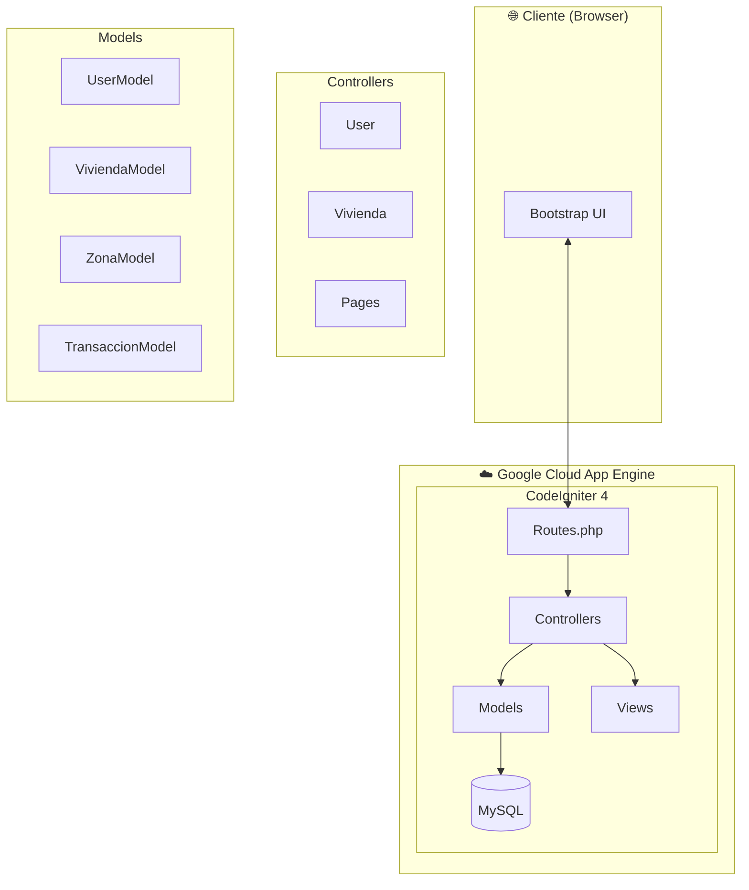

# 🏠 InmoGest - Plataforma Inmobiliaria


## 📋 Descripción

**InmoGest** es una aplicación web de gestión inmobiliaria que permite a los usuarios publicar, buscar, comprar y alquilar propiedades. La plataforma resuelve la necesidad de centralizar la oferta inmobiliaria de una zona específica (Jaén, España), proporcionando un sistema donde:

- **Propietarios** pueden registrar sus viviendas con información detallada (metros cuadrados, habitaciones, certificado energético, precio, etc.)
- **Clientes** pueden buscar propiedades aplicando filtros avanzados y realizar transacciones de compra o alquiler
- **Administradores** gestionan el catálogo completo de usuarios y propiedades

---

## 🏗️ Arquitectura del Proyecto

El proyecto sigue el patrón **MVC (Model-View-Controller)** de CodeIgniter 4:



### Estructura de Carpetas

```
Pagina-web-immobiliaria/
├── WebappProyecto/                # Aplicación principal
│   ├── app/
│   │   ├── Controllers/           # Lógica de negocio
│   │   │   ├── User.php           # Autenticación y gestión de usuarios
│   │   │   ├── Vivienda.php       # CRUD de propiedades
│   │   │   ├── Pages.php          # Páginas estáticas
│   │   │   └── RegistroLogin.php  # Vistas de login/registro
│   │   ├── Models/                # Capa de datos
│   │   │   ├── UserModel.php
│   │   │   ├── ViviendaModel.php
│   │   │   ├── ZonaModel.php
│   │   │   └── TransaccionModel.php
│   │   ├── Views/                 # Plantillas de interfaz
│   │   │   ├── templates/         # Header/Footer
│   │   │   ├── pages/             # Páginas públicas
│   │   │   ├── user/              # Panel de usuario
│   │   │   └── vivienda/          # Gestión de propiedades
│   │   ├── Filters/               # Middleware de autenticación
│   │   └── Config/                # Configuración y rutas
│   ├── public/                    # Assets públicos (CSS, JS, imágenes)
│   ├── .env                       # Variables de entorno
│   └── app.yaml                   # Configuración Google App Engine
├── db/
│   └── webappproyecto.sql         # Script de base de datos
└── doc/
    └── Modelo Entidad-Relacion.jpg
```

---

## 🛠️ Stack Tecnológico

| Categoría | Tecnología |
|-----------|------------|
| **Lenguaje** | PHP 7.4 / 8.0 |
| **Framework** | CodeIgniter 4 |
| **Base de Datos** | MySQL / MariaDB 10.4+ |
| **Frontend** | HTML5, CSS3, Bootstrap 5 |
| **Servidor** | Google Cloud App Engine (PHP 7.4 runtime) |
| **Testing** | PHPUnit 9.x |
| **Dependencias** | Composer, Laminas Escaper, PSR Log |

---

## ⚙️ Prerrequisitos

- **PHP** >= 7.4 con extensiones: `intl`, `json`, `mbstring`, `mysqli`
- **Composer** >= 2.0
- **MySQL** / MariaDB >= 10.4
- **Servidor web** Apache o NGINX (o el servidor integrado de PHP para desarrollo)

---

## 🚀 Instalación

### 1. Clonar el Repositorio

```bash
git clone https://github.com/tu-usuario/Pagina-web-immobiliaria.git
cd Pagina-web-immobiliaria/WebappProyecto
```

### 2. Instalar Dependencias

```bash
composer install
```

### 3. Configurar Base de Datos

```bash
# Crear la base de datos
mysql -u root -p -e "CREATE DATABASE webappproyecto CHARACTER SET utf8 COLLATE utf8_unicode_ci;"

# Importar el schema
mysql -u root -p webappproyecto < ../db/webappproyecto.sql
```

### 4. Configurar Variables de Entorno

Edita el archivo `.env` para desarrollo local:

```ini
# Cambiar a development
CI_ENVIRONMENT = development

# Comentar la configuración de producción y descomentar localhost
# database.default.hostname = 34.65.85.132
# ...

database.default.hostname = localhost
database.default.database = webappproyecto
database.default.username = webappuser
database.default.password = admin
database.default.DBDriver = MySQLi

# Comentar baseURL de producción
# app.baseURL = 'https://tbw2223-5-jar.oa.r.appspot.com'
```

### 5. Ejecutar en Desarrollo

```bash
php spark serve
```

Accede a la aplicación en: `http://localhost:8080`

---

## 📖 Uso

### Endpoints Principales

| Método | Ruta | Descripción | Autenticación |
|--------|------|-------------|---------------|
| `GET` | `/inicio` | Página principal con listado de viviendas | No |
| `GET` | `/ofertas` | Propiedades en oferta | No |
| `GET` | `/novedades` | Propiedades recientes | No |
| `POST` | `/loginprocess` | Procesar login | No |
| `POST` | `/register` | Registrar nuevo usuario | No |
| `GET` | `/alta` | Formulario para añadir propiedad | Usuario |
| `POST` | `/subirVivienda` | Crear nueva propiedad | Usuario |
| `POST` | `/busquedadProcess` | Buscar propiedades con filtros | No |
| `POST` | `/comprarTransaccion` | Comprar una propiedad | Usuario |
| `POST` | `/alquilarTransaccion` | Alquilar una propiedad | Usuario |
| `GET` | `/admin_list` | Panel de administración | Admin |

### Ejemplo: Búsqueda de Propiedades

```javascript
// POST /busquedadProcess
// Content-Type: application/x-www-form-urlencoded

zona=7&
min_metros=50&
max_metros=200&
min_habitaciones=2&
max_habitaciones=5&
tipo_transaccion=venta
```

---

## ✨ Funcionalidades

- [x] **Autenticación de usuarios** con roles (cliente/admin)
- [x] **Registro de usuarios** con validación de datos
- [x] **CRUD de propiedades** (crear, editar, eliminar viviendas)
- [x] **Subida de imágenes** para las propiedades
- [x] **Sistema de búsqueda** con filtros múltiples (zona, metros, habitaciones, precio)
- [x] **Gestión de transacciones** (compra y alquiler)
- [x] **Panel de usuario** con "Mis Propiedades"
- [x] **Historial de transacciones** (compradas/alquiladas)
- [x] **Panel de administración** para gestionar usuarios y viviendas
- [x] **Clasificación por zonas** geográficas (16 zonas de Jaén)
- [x] **Certificado energético** (A-E) para cada propiedad
- [x] **Sección de ofertas** y **novedades**
- [x] **Diseño responsive** con Bootstrap

---

## 🤝 Contribución

Las contribuciones son bienvenidas. Por favor, sigue estos pasos:

1. **Fork** el repositorio
2. Crea una rama para tu feature:
   ```bash
   git checkout -b feature/nueva-funcionalidad
   ```
3. Realiza tus cambios y haz commit:
   ```bash
   git commit -m "feat: añadir nueva funcionalidad"
   ```
4. Sube los cambios a tu fork:
   ```bash
   git push origin feature/nueva-funcionalidad
   ```
5. Abre un **Pull Request** describiendo los cambios

### Convenciones
- Usa [Conventional Commits](https://www.conventionalcommits.org/) para los mensajes
- Asegúrate de que los tests pasen: `composer test`
- Sigue el estándar de código de CodeIgniter

---

## 👥 Autores

- **Juan Antonio Acosta Molina**
- **Rubén Prieto García**

---

## 📄 Licencia

Este proyecto está licenciado bajo la **MIT License** - ver el archivo [LICENSE](WebappProyecto/LICENSE) para más detalles.

---

## 🔗 Enlaces

- **Producción:** https://tbw2223-5-jar.oa.r.appspot.com
- **Storyboard (Marvel):** https://marvelapp.com/prototype/69c65bc
- **GitLab Original:** https://gitlab.ujaen.es/Grupo5/TBW2223_equipo5